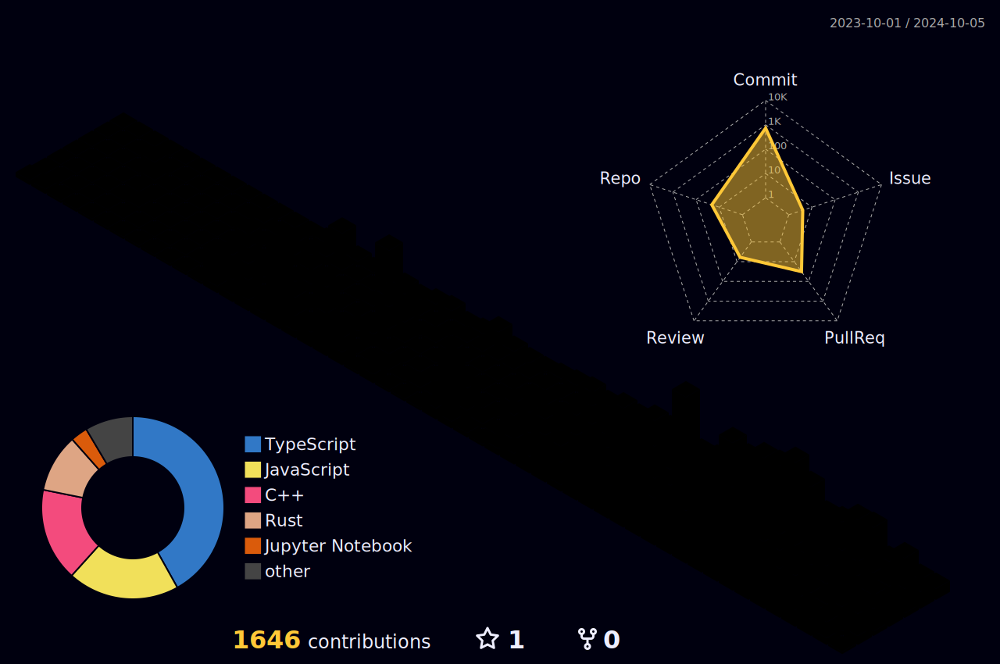

<h3 align="center">About</h3>

- 👨‍💻 Currently in the second semester of my freshman year at the National University of Singapore, studying Computer Science with a second major in Statistics.
- ⚛️ Trying to pick up C++, React and Astro in my free time. Considering messing around with ThreeJS too.
- 💡 Interested in C++, Tensorflow and Pytorch, as well as fullstack development.

<h3 align="center">Contact/Links</h3>

- 📩 yeohhanyi0916@gmail.com
- 🤝 [LinkedIn](https://www.linkedin.com/in/yeoh-han-yi)
- 📁 [Resume](https://github.com/yhanyi/yhanyi/blob/main/Resume.pdf)
- 💻 [Personal Website](https://yhanyi.vercel.app)
- 🤖 [Kaggle](https://www.kaggle.com/yeohhanyi)

<h3 align="center">Languages and Tools</h3>

    <a href="https://skillicons.dev">
         
        
    </a>

    
    

    

